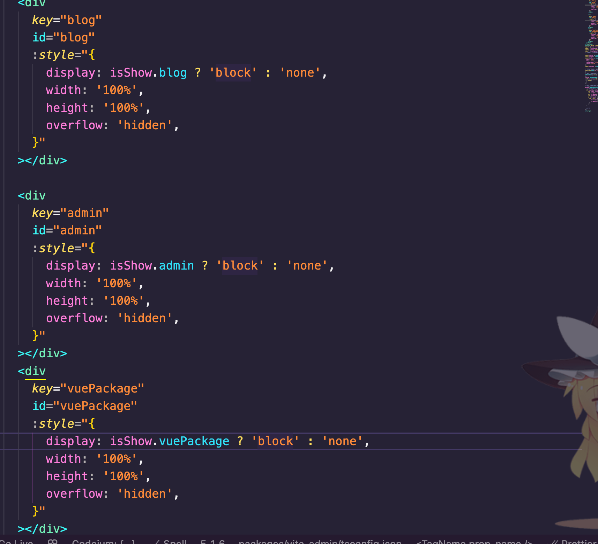

## 简易微前端项目
 目前运行正常 
## 设计思路
根据子应用的数量，去预设相同数量的盒子，每一个子应用对应一个 iframe。
 vue 项目的子应用内部路由跳转，统一通知主应用，主应用改变浏览器地址后通知子应用跳转，主应用内部的路由跳转不影响其它。
 react 项目也是可以用，但是没有vue 项目那么丝滑，对react 路由知识掌握有限

## 主要实现的功能
主应用打开子应用，子应用打开主应用，子应用相互打开
vue 子应用的页面状态保持
自定义的了一些跳转通知的方法，暂无打包验证
